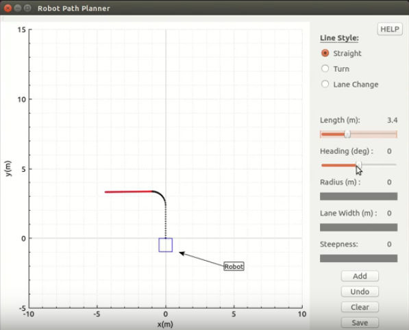
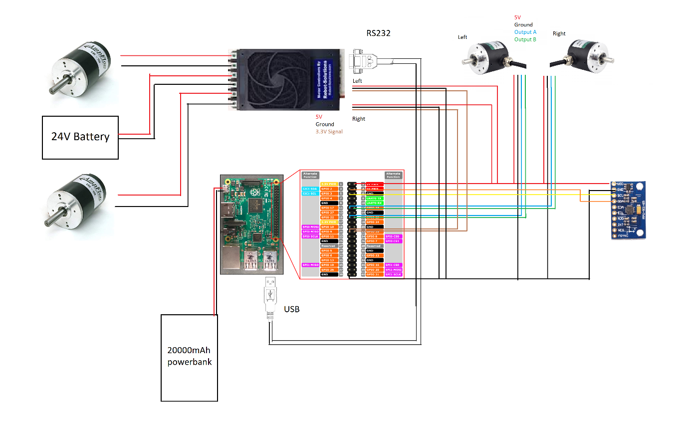
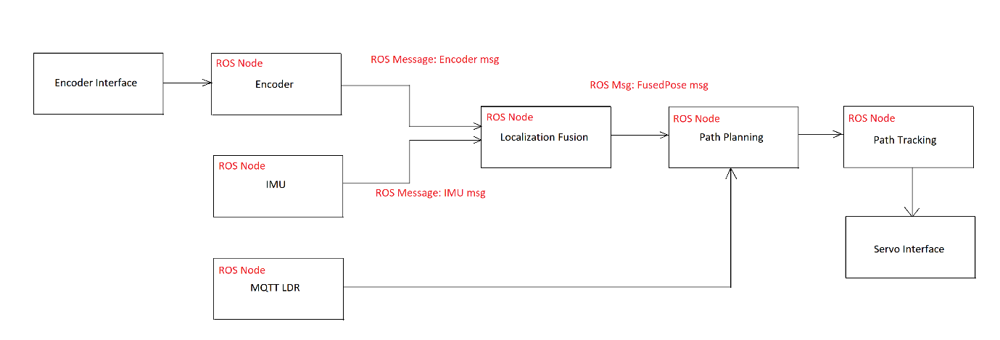

# **Differential Robot with Raspberry PI**

## Objective
To replicate consistent test cases for autonomous vehicle scenario testing. The motion of robot is triggered by laser gate. Robot is equipped with encoder and imu to obtain its position information and motor controllers for speed control. The robot is able to draw a pre-defined path (using built-in tool to draw) according to input speed profile. 

*Fig 0: Drawing path using a built-in tool*

#### Hardware

- 2x Optical Encoders
- MPU9255 IMU 
- Raspberry Pi 3 B+
- Buck Converter 
- 20000mAh Powerbank
- AMPFLOW Motor Controller
- 4x 60A DC Motors

*Fig 1: Circuit diagram*

#### Software

*Fig 2: Software architecture*

## Dependencies
#### Tested with Raspberry Pi 3 B+

- ROS
- MQTT

